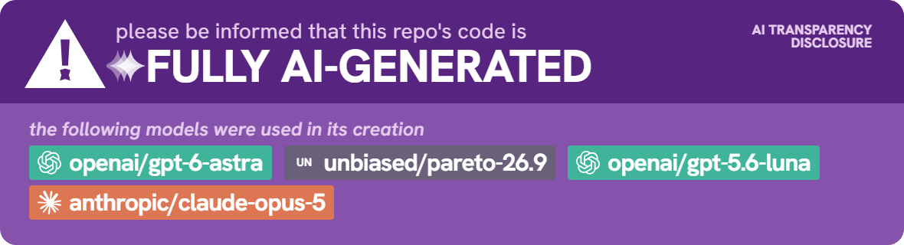

# SoundOff

SoundOff turns recordings into editable transcripts on your own computer. Nothing is uploaded and there's no account.

- Import audio or video, or record your microphone and/or computer sound.
- Transcribe in English or Filipino.
- Play it back with the current word highlighted. Click any word to jump there.
- Fix the text, name the speakers, and adjust timing.
- Export as plain text, text with timestamps, or SRT subtitles.

## Download and install

Get the installer for your computer from the [releases page](https://github.com/vaynealtapascine/SoundOff/releases).

- **Windows:** run `SoundOff-…-win-x64-setup.exe`. It isn't signed, so Windows may warn you first. Click **More info**, then **Run anyway**. On the installer's last page, leave **Set up transcription** ticked. A window opens and downloads the speech engine (about 2 GB). Wait for it to say it's done.
- **Mac:** open the `.dmg` (`arm64` for Apple Silicon, `x64` for Intel) and drag SoundOff to Applications. The app isn't signed, so the first time macOS will block it. Go to System Settings → Privacy & Security and click **Open Anyway**. You'll also need ffmpeg: `brew install ffmpeg`.
- **Linux (Debian/Ubuntu):** `sudo apt install ./SoundOff-…-linux-x64.deb`

**Only the Windows version has been tested.** The Mac and Linux versions haven't been tried yet. Recording your microphone and computer sound at the same time only works on Windows.

If transcription isn't set up yet, SoundOff shows a **Set up transcription** button in the Transcribe card.

## Using SoundOff

1. **Open a recording.** Choose **Transcribe a file**, drag a file onto the window, or use **Record**.
2. **Download the speech models.** The first time, click **Prepare model pack**. This is another 2 GB and only happens once.
3. **Transcribe.** Pick the language (or let it detect) and click **Transcribe**.
4. **Review and fix.** Press play and follow along. Edit any text, rename speakers, or split and merge paragraphs. Press **Ctrl+S** to save. Every save can be undone, even after closing the app.
5. **Export** from the top bar.

The transcript is a machine's best guess, so check it before you rely on it.

Press **F1** in the app for the full guide, including keyboard shortcuts.

### Things to know

- Use headphones when recording your mic and computer together. There's no echo cancellation.
- Playback speed goes from 0.5× to 2× without changing pitch.
- Your projects and exports aren't encrypted. Anyone with access to your computer can read them.
- SoundOff only goes online to set up transcription and download the speech models.

## Not done yet

- Signed app
- Automatic speaker detection (you can name speakers yourself)
- Recording a single app rather than all computer sound
- Mobile

## For developers

```bash
dotnet build SoundOff.sln -c Release
dotnet test SoundOff.sln -c Release --no-build
dotnet src/SoundOff.Desktop/bin/Release/net8.0/SoundOff.Desktop.dll
```

Building from source needs ffmpeg on your `PATH` and, for transcription, `python scripts/setup_runtime.py` (needs [uv](https://docs.astral.sh/uv/)). Full check: `python scripts/verify.py --clean --desktop-smoke`. The installers are built by `.github/workflows/release.yml` from the files in `packaging/`.

See [ARCHITECTURE.md](ARCHITECTURE.md) for the design, [docs/VERIFICATION.md](docs/VERIFICATION.md) for what has and hasn't been tested, and [docs/HELP.md](docs/HELP.md) for the in-app guide.

## License

MIT. See [LICENSE](LICENSE).
